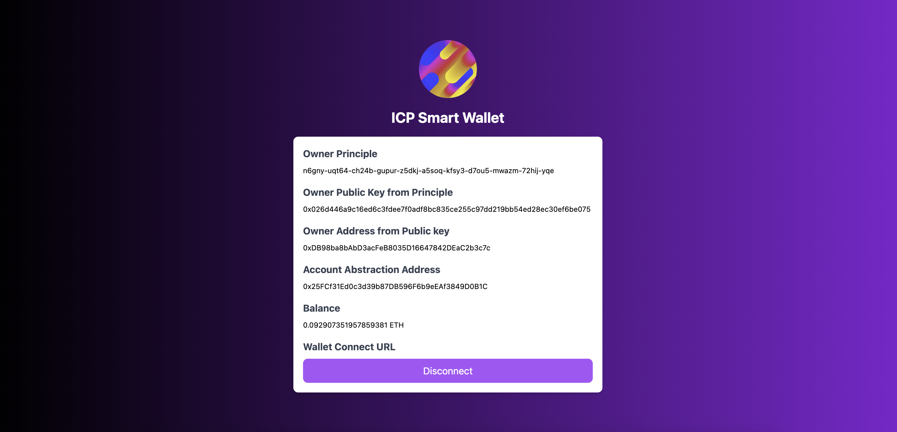
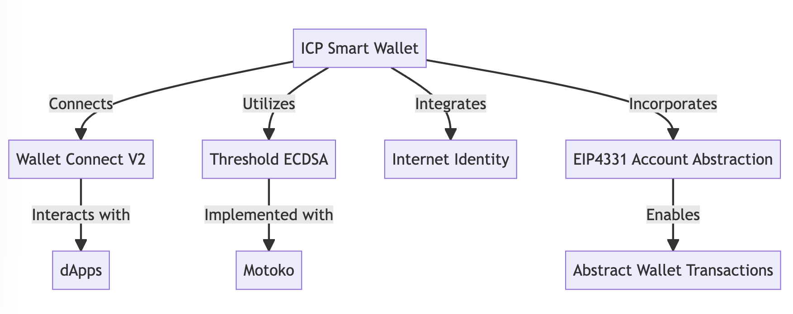

# ICP Smart Wallet

Account Abstraction Wallet with Threshold ECDSA on ICP



## Live App

Coming Soon!

## Pitch Deck

Coming Soon!

## Video Demo

Coming Soon!

## Description

ICP Smart Wallet is a highly innovative, Account Abstraction Wallet developed to operate with Threshold ECDSA on the Internet Computer Protocol (ICP). It is designed to integrate seamlessly with on-chain wallets using Motoko-based Threshold ECDSA and Internet Identity, thereby offering users a smooth and secure experience. Moreover, the wallet incorporates EIP4331 Account Abstraction wallet infrastructure to enhance its functionality and interaction with diverse platforms.

## Benefit

ICP Smart Wallet stands out by providing a fully on-chain, networked-custody wallet within the Ethereum Account Abstraction ecosystem. The integration of advanced technologies ensures that users have a secure and streamlined experience when interacting with various dApps. The benefits of using ICP Smart Wallet include:

- Enhanced Security: The use of Threshold ECDSA and Internet Identity ensures top-notch security for user accounts and transactions.
- Universal Accessibility: Being browser-based, the wallet is accessible to a broad audience and isn’t restricted by app store licensing.
- Innovative Account Abstraction: The incorporation of EIP4331 account abstraction allows for advanced transaction capabilities and user interactions.

## Technical Detail



- ICP Smart Wallet connects through Wallet Connect V2 to interact with various dApps.
- ICP Smart Wallet utilizes Threshold ECDSA, which is implemented with Motoko for enhanced performance and security.
- ICP Smart Wallet integrates Internet Identity for secure and seamless user authentication.
- ICP Smart Wallet incorporates EIP4331 Account Abstraction, which enables the creation of Abstract Wallet Transactions.

## Run

### Local

```
cd app
npm install
dfx deploy
```

The above command gives locally deployed app url like this.

```
URLs:
  Frontend canister via browser
    app_frontend: http://127.0.0.1:4943/?canisterId=dlbnd-beaaa-aaaaa-qaana-cai
    internet_identity: http://127.0.0.1:4943/?canisterId=aovwi-4maaa-aaaaa-qaagq-cai
  Backend canister via Candid interface:
    app_backend: http://127.0.0.1:4943/?canisterId=ahw5u-keaaa-aaaaa-qaaha-cai&id=dccg7-xmaaa-aaaaa-qaamq-cai
    internet_identity: http://127.0.0.1:4943/?canisterId=ahw5u-keaaa-aaaaa-qaaha-cai&id=aovwi-4maaa-aaaaa-qaagq-cai
```

### Note

ICP Smart Wallet requires to connect dApp with Wallet Connect V2. This is the sample wallet connect dApp used in the demo.

https://react-app.walletconnect.com/

## Reference

ICP Smart Wallet's architecture is developed by extending the below Oisy Wallet concept.
https://github.com/dfinity/ic-eth-wallet

ICP Smart Wallet's Threshold ECDSA is developed by extending the below Motoko example contract.
https://github.com/dfinity/examples/tree/master/motoko/threshold-ecdsa
